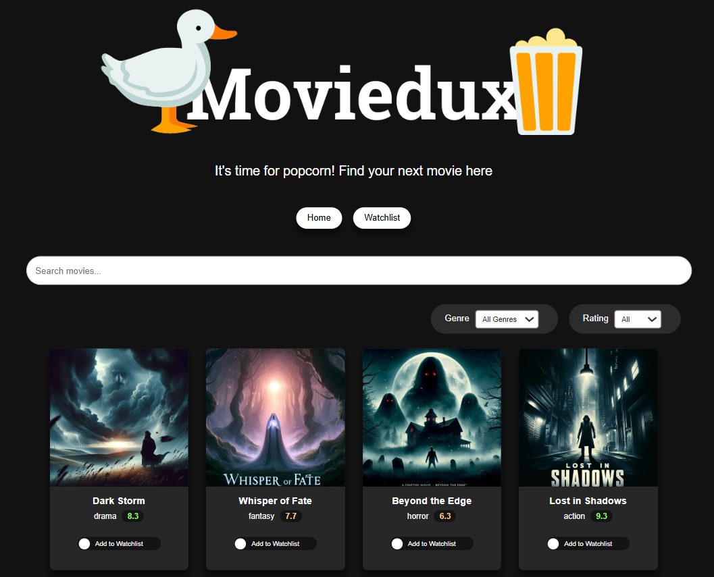

# React 18 Course 2025 – Learn React JS the Fast Way

## Course Link

[https://www.udemy.com/course/master-react](https://www.udemy.com/course/master-react)

## About

MovieDux is a React single‑page application that loads movies from a JSON file and displays them as interactive cards. You can search by title, filter by genre or rating, and add or remove films from your personal watchlist.



## Setup & Run

Follow these steps to get the project up and running on your local machine.

### Prerequisites

- **Node.js** v14+  
- **npm** v6+ (bundled with Node.js)

### Installation

1. **Clone the repository**  
   ```bash
   git clone https://github.com/valeriia-nedashkivska/udemy-moviedux.git
   cd udemy-moviedux
   ```

2. **Install dependencies**
    ```bash
    npm install
    ```

3. **Format the code (if you want to apply consistent styling)**
    ```bash
    npm run beautify
    ```

4. **Run the Development Server**
    ```bash
    npm run dev
    ```